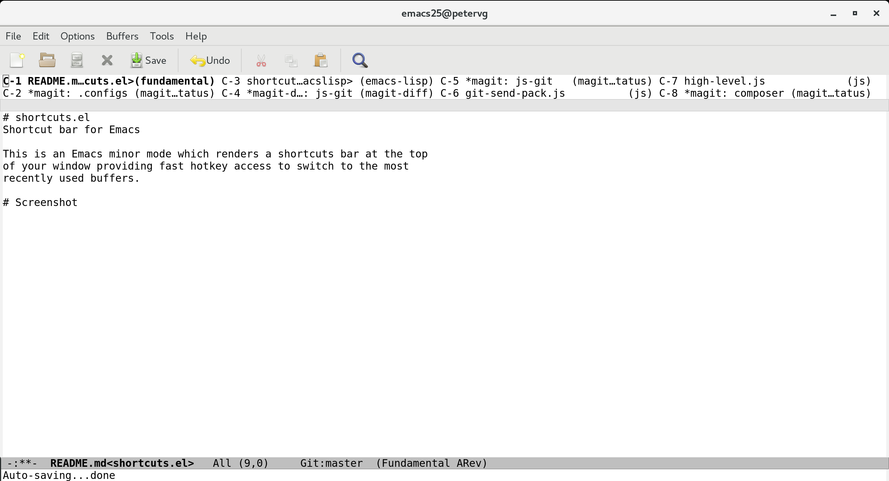

# shortcuts-mode
Shortcut bar for Emacs

This is a minor mode which adds a sticky window to the top of the
frame listing the last ten buffers that were accessed.  You can
then instantly switch the current window to one of the recent
buffers using C-1 through C-0.  Think of it as an extremely
lightweight tab bar oriented around keyboard navigation.

The shortcut bar also supports basic mouse navigation.  Left click
switches the current window to the selected buffer, and middle
click kills the selected buffer.

As a special case, certain utility buffers (*Buffer List*,
*Ibuffer*, the *shortcuts* buffer itself) are excluded from the top
bar.  Dired buffers are also filtered, because otherwise navigating
the filesystem through Dired (which creates a new buffer for each
directory) tends to fill up all the top slots.

# Installation

1. Download `shortcuts-mode.el`
2. Type `M-x package-install-file` and enter the path to where you put `shortcuts-mode.el`
3. Type `M-x shortcuts-mode` to enable or disable it.

This package has been submitted to [MELPA](https://melpa.org/) and may also
be available through there by the time you read this.

# Screenshot

